# The Corner Bistro 

## Introduction 

The concept of the site came to my when i was looking around the internet for information on differnt coffee machines to percous. after i got one the real trubole shooting started. i was going from formum to forum trying to sift throught the information i was looking for. i thought it might be a better idea to create a space for coffee inthosast to come to gether to be able to ask questions and in general selibrate coffee.
The Coffee Social API is Front-End React App, the Coffee Social. The coffee Social is a social site for coffee lovers to post or blog about there coffee jerney and or to trouble shoot there coffee recipes.
The site allows an Admin user to login using a pre-registered login(superuser) from there the Admin-user can create, read, update and delete(CRUD) Profiles, post and comments. 
This website also allows a users to create a login, make a post on the wbesite and view an edit the there posts and comment/like others. 

 + This is a link to my live website [Live site](https://coffee-social-react-9c0fd55d8b45.herokuapp.com/)
 + This is a link to my Repo [Repo](https://github.com/Brionconroy/coffee-social-react)

--- 

## Table of Contents 

 
 

 - ## [Introduction](#introduction) 

 
 

 - ## [Agile Methodologie](#agile-methodologie-1) 

 
 

 - ## [User Experience](#user-experience-1) 

 
 

 - ## [Features](#features-1) 

 
 

 - ## [Technologies](#technologies-1) 

     

- ## [Testing](#testing-1) 

    - ## [Bugs](#bugs-1) 

    - ## [Manual Testing](#manual-testing-1) 

    - ## [Code Validation](#code-validation-1) 

    - ## [Responsiveness Testing](#responsiveness-testing-1) 

     

 
 

- ## [Deployment](#deployment-1) 

 
 

- ## [Credits](#credits-1) 

--- 

 
 

## Agile Methodologie 

 
 

Agile principles were utilised throughout the planning and development of this project. The tecnoligy used in this project was github issues which were categorised into user storys, seperate out into tasks for various aspects of the project. The issues were then added into a project board through github issues as shown. 

 
 

 

 
 

Agile
  

 
 

 

 
 

 

 
 
 

I created a user storys template through github issues to layout each user stories containing acceptance criteria. These requirements were altered through the project as things dont always go to plan and new ideas can happen. I also used the MoSCoW method while developing this project this helped to prioritize certian feature ahead of others by using tags on the user storys into three differnt actagorys (Must Haves, Should Have, Could Have). By focusing on the Must Haves first you end up with a MVP (minimuim viable prject) qiucker. 

 
 

 

 
 

User Storys
  

 
 

 

 
 

 

 
 

## User Experience 

 
 

As a new visitor to the site, I would like to be able to make a booking and edit it acourdingly. i would also like to be able to login to the website so that i may find and edit my booking. As a returning customer, I want to be able to easily navigate the site and quickily find what I'm looking for. I would also like the ability to contact the Resteraunt directly through their website. 

 
 

### The User Experience Design was constructed using the five planes. 

 
 

+ Stratagy: Is this content relvent to the user and is it culturally appropriate? 

+ Scope: Are we accomplishing our goals of create a space that people will come together to discuss coffee. 

+ Structure: How many pages should we have in our website and why? 

+ Skeleton: Does the structure of the wireframe meet the users needs? Is the web page responsive? 

+ Surface: Does the site look good visully? Does it have enough images and colours? 

 
 

 

 
 

Desktop Landing Page
  

 
 

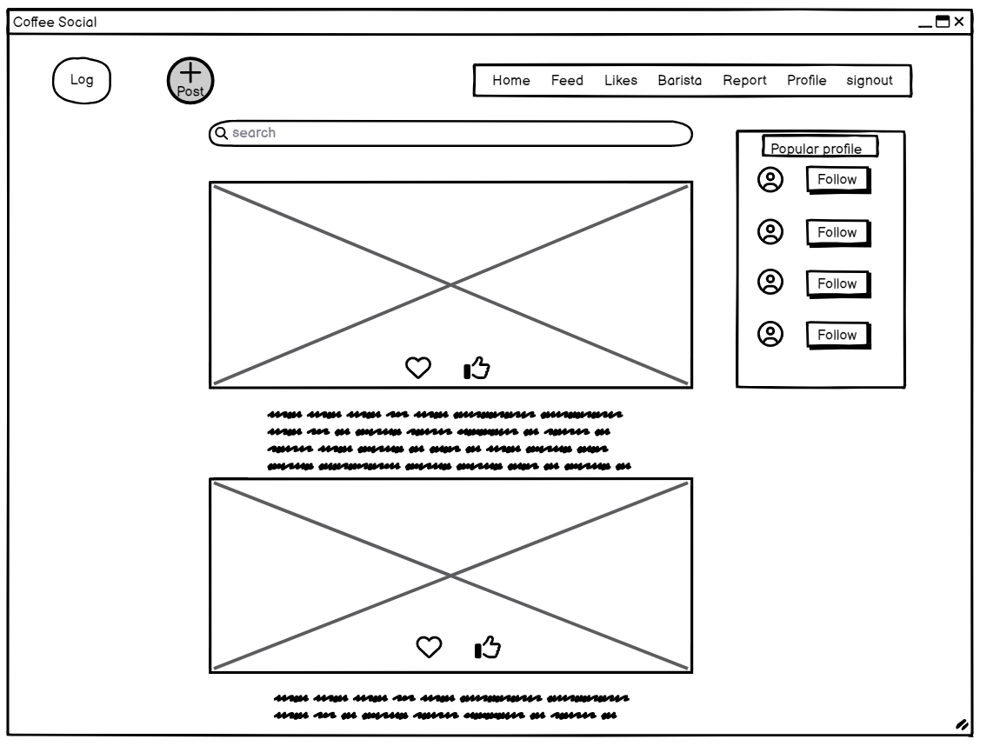 

 
 

 

 
 

 

 
 

Mobile Landing Page
  

 
 

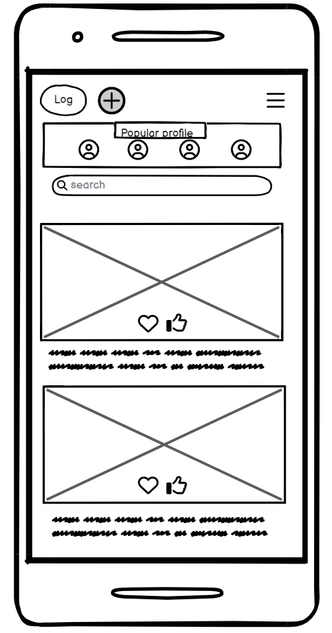 

 
 

 

 
 

# Features 

 
 

## Navbar

+ The Navbar contains the logo for the website and when you click on it it will bring you to the home page. 

+ The sticky navbar, has 8 differnt heading, the heading will change if you are login from login to loggout. 

+ The header reflects the login state of the user by showing the login or the log out icon inthe header. 

 
 

 

 
 

Login
  

 
 

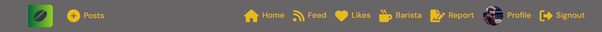 

 
 

 

 

 
 

Loggout
  

 
 

 

 
 

 

 
## Log-in form

+ The log in on the navbar will disapear when you have logged in confreming your login 

+ on the login form you can also sign up if you havent alread done so. 

 

Log-in
  

 
 

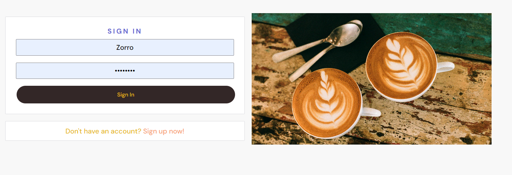 

 
 

 

 
 

## Sign-up form

 
 

+ The sign-up form maneks you enter your new password twice and is case sensitve. when youve sign-up it will bring you to the sign-in page outomaticly.

 
 

 

 
 

Sign-up
 

 
 

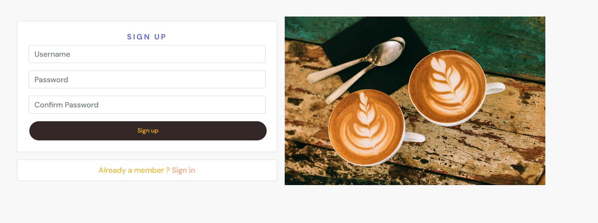 

 
 

 

 
 

## Profile Page

 

 
 

Profile Page
 

 
 

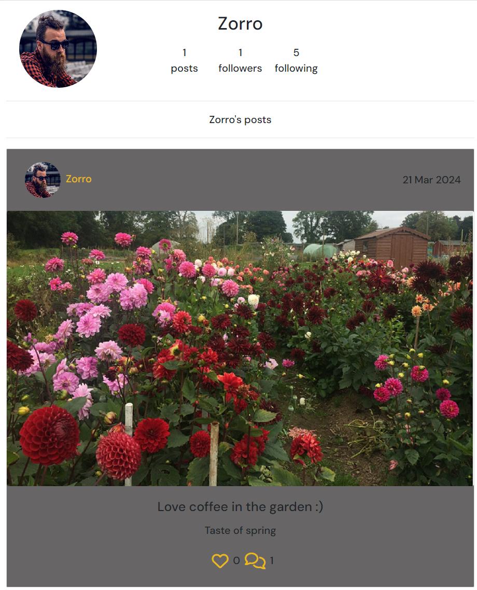 

 
 

 

 
 

## Edit Profile Page

 
 

+ the edit profile page lets you add a profile picture, edit you password and user name or add yourself as a Barista user.

 
 

 

 
 

Edit Profile Page
 

 
 

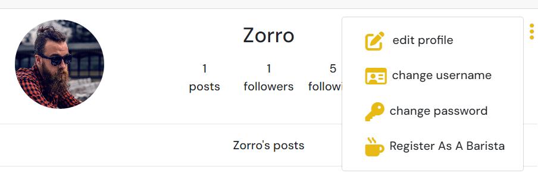 

 
 

 

 
 
## Barista registation form

 
 

+ This form lets you sign up as a barista.

 
 

 

 
 

Barista registation form
 

 
 

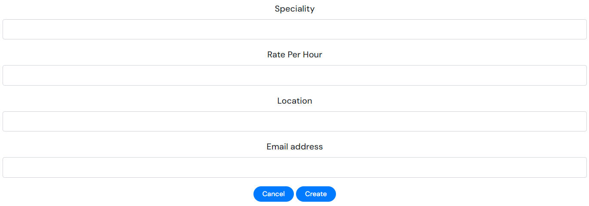 

 
 

 

 
 

## Barista Page

+ this page lets you see the barista that are registeed and you create reviews and lets you see others reviews

 

 
 

Barista Page
 

 
 

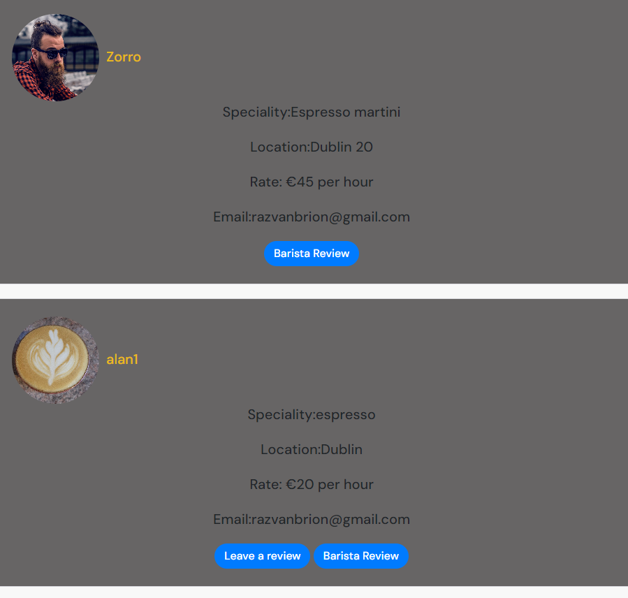 

 
 

 

## Reviews Page

+ This page lets you review barista that are registered 

 

 
 

Reviews Page
 

 
 

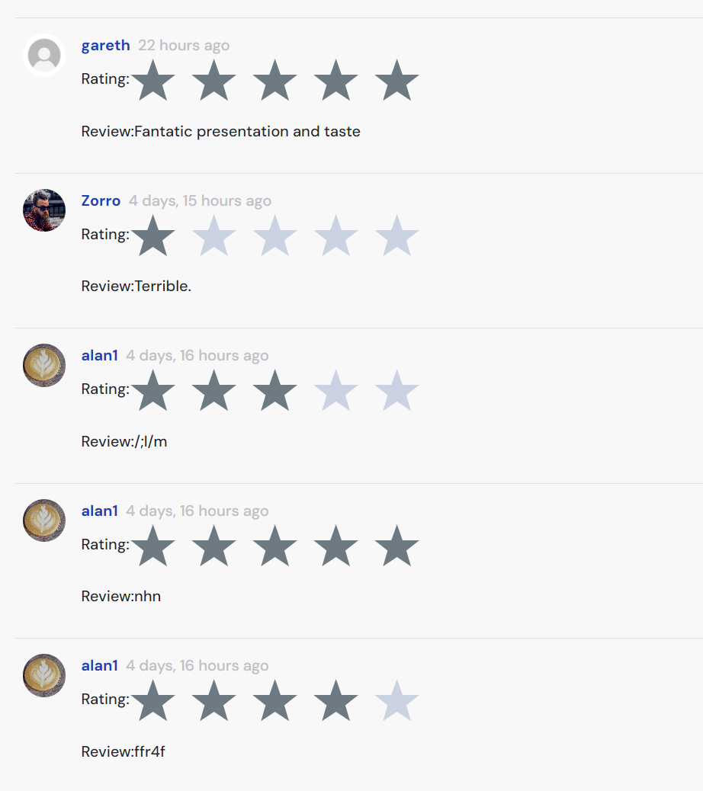 

 
 

 

## Reviews Form

+ This page lets you write a review for baristas.

 

 
 

Reviews Form
 

 
 

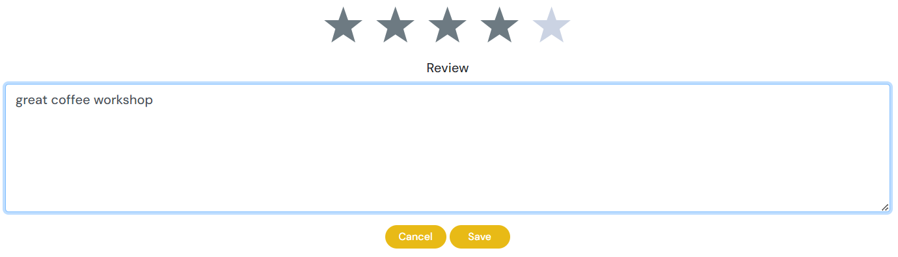 

 
 

 

## Post Form page

+ This page lets you create a post with images and contect.

 

 
 

Post Form page
 

 
 

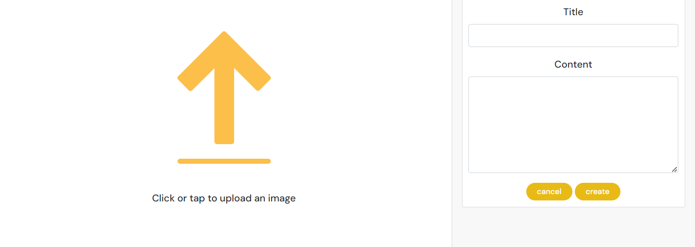 

 
 

 

## Edit Posts

+ This page lets you create a post with images and contect.

 

 
 

Edit Posts
 

 
 

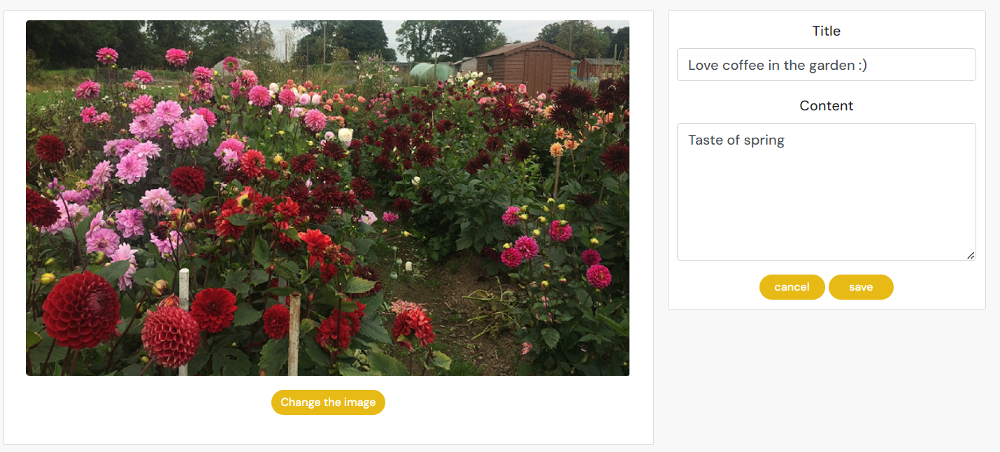 

 
 

 

## Like a Post

+ This feture lets you like a post.

 

 
 

Like a Post
 

 
 

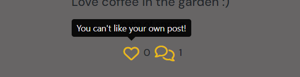 

 
 

 

## Comment on a Post

+ This feture lets you like a post.

 

 
 

Comment on a Post
 

 
 

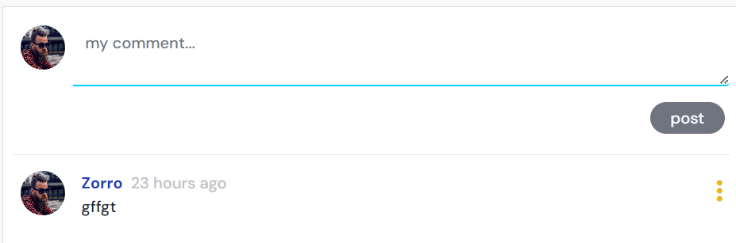 

 
 

 

## Edit a Comment

+ This feture lets you make a comment on a post.

 

 
 

Edit a Comment
 

 
 

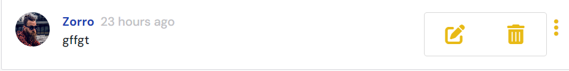 

 
 

 

## Search Bar

+ This lets you search the site for profiles and posts.

 

 
 

Search Bar
 

 
 

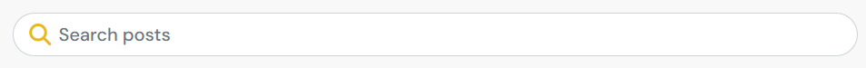 

 
 

 

## Most followed Profile

+ This lets you see the most popular profiles on the sociial website.

 

 
 

Most followed Profile
 

 
 

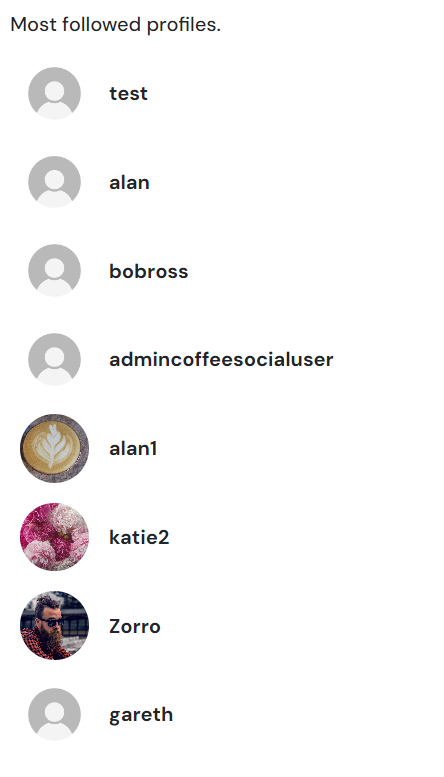 

 
 

 

## Contact Admin

+ This lets you Contact the administaor of the site for quieries and reports offensive content.

 

 
 

Contact Admin
 

 
 

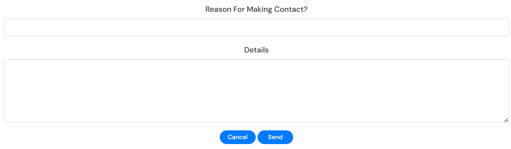 

 
 

 

 
 

## Technologies 

 
 

### Libraries, Frameworks, Tools 

 
 

* [Django 3.2.22](https://www.djangoproject.com/) 

* [Bootstrap 4.6.2](https://getbootstrap.com/docs/4.6/getting-started/introduction/) 

* [Heroku](https://www.heroku.com) 

* [React](https://legacy.reactjs.org/) 

* [Node](https://nodejs.org/en) 

* [ElephantSQL](https://www.elephantsql.com/) 

* [SQLite3](https://www.sqlite.org/index.html) 

* [Google Fonts](https://fonts.google.com/) 

* [Cloudinary 1.36.0](https://cloudinary.com/) 

* [Gunicorn 21.2.0](https://gunicorn.org/) 

* [Psycopg2 2.9.9](https://pypi.org/project/psycopg2/) 

* [GitPod](https://www.gitpod.io/) 

* [GitHub](https://github.com/) 

* [FontAwesome](https://fontawesome.com/) 

* [W3C Validator](https://validator.w3.org/) 

* [W3C CSS Validator](https://jigsaw.w3.org/css-validator/) 

* [Lighthouse](https://developer.chrome.com/docs/lighthouse/overview/) 

* [Balsamiq](https://balsamiq.com/wireframes/?gad=1&gclid=CjwKCAjwr_CnBhA0EiwAci5sikJlbA3yk1dYGRdNiY0Krv7_98bWbqabFd_DxfjzG1-J7kWnl2-byhoC2cIQAvD_BwE) 

 
 

### Languages 

 
 

* [HTML5](https://www.w3schools.com/html/) 

* [CSS3](https://www.w3schools.com/css/) 

* [Javascrpt](hhttps://devdocs.io/javascript/) 

 
 
 

# Testing 

 
 

### Bugs 

 
 

+ My my report section was not send reports to the data base, this was dou to an incorect url naming convention. it was an easy fix by changing contact-admins to contact-admin. by removing the s everthing worked fine.

 
 

### Manual Testing

## Features Testing

**Navbar**

|Test  | Expected Outcome  | Pass or Fail |
|--|--|--|
| The Corner Bistro Logo present | Yes  | Pass |
| Click Logo in navbar | Home page Redirect | Pass |
| Click Home in navbar | Home page Redirect | Pass |
| Click Menu in navbar| Bring user to menu page | Pass |
| Click Log-in | Redirect to Log-in page | Pass |
| Click Log-out | Redirect to Log-out page | Pass |
| Click Sign-up | Redirect to Sign-up page | Pass |
| If user Logged in booking appears in navbar | log-in disappears and booking appears | Pass |
| Click Booking in navbar | Redirect to Booking page | Pass |

**Profiles**

|Test  | Expected Outcome  | Pass or Fail |
|--|--|--|
| Ensure user can register | Yes  | Pass |
| Ensure you can edit your profile (edit password, username and profile picture) | Yes  | Pass |
| Ensure profile page displays correct content | Yes | Pass |
| Ensure users can follow/unfollow other users | Yes | Pass |
| Ensure you can post when logged in | Yes | Pass |
| Make sure you can sign up as an Barista | Yes | Pass |

**Create a Post**

|Test  | Expected Outcome  | Pass or Fail |
|--|--|--|
| Make sure when pressing Posts in the navbar it redirects you to the post from | Yes  | Pass |
| Make sure that when post is created that it is editable (edit and delete functinality) | Yes  | Pass |
| Make sure the comment and like counters are working apropritley  | Yes  | Pass |
| Make sure infinit scroll is working on the post list page | Yes  | Pass |

**Contact Adiministater**

|Test  | Expected Outcome  | Pass or Fail |
|--|--|--|
| Make sure you can navagite to contact-admin in navbar and be able to submit the form | Yes  | Pass |

**Like a Post**

|Test  | Expected Outcome  | Pass or Fail |
|--|--|--|
| Make sure when you press the like button it lights up | Yes  | Pass |
| Make sure when you press the like button the number of likes goes up | Yes  | Pass |
| Make sure when you press the like button again it unlikes the post. | Yes  | Pass |
| Make sure when you navigate to the likes in the navbar you see all the posts youve liked | Yes  | Pass |

**Comment on a Post**

|Test  | Expected Outcome  | Pass or Fail |
|--|--|--|
| Ensure user can create a comment on a post by clicking the speech icon | Yes  | Pass |
| Make sure when you Edit a comment by clicking the three dot it works | Yes  | Pass |
| Make sure when you Delete a comment by clicking the three dot and preesing delete | Yes  | Pass |
| Make sure that all the comments on a post can be viewed | Yes  | Pass |
| Make sure that the time you posted the comment is correct | Yes  | Pass |

**Sign-up**

|Test  | Expected Outcome  | Pass or Fail |
|--|--|--|
| Sign-up form creates an account on the database | Yes  | Pass |
| Form must have a username to create an account | Yes  | Pass |
| Form must have a password to create an account | Yes  | Pass |
| Account will only be created if password is entered twice correctly | Yes  | Pass |
| The sign up button will redirect you to home page | Yes  | Pass |
| The sign up button will redirect to sing-in page | Yes  | Pass |

**Sign-in**

|Test  | Expected Outcome  | Pass or Fail |
|--|--|--|
| Sign-in form signs in a user if information is correct  | Yes  | Pass |
| Sign-in form dose not signs in a user if information is incorrect  | Yes  | Pass |
| Sign-in form will throw a (The username and/or password you specified are not correct.) if password is incorrect| Yes  | Pass |
| Sign-in form will throw a (The username and/or password you specified are not correct.) if username is incorrect| Yes  | Pass |
| The Remember Me if toggled remembers users information | Yes  | Pass |
| Clicking sign-in button will sign you in | Yes  | Pass |
| Clicking sign-in button will also return you to the home page if clicked | Yes  | Pass |

**Sign-out**

|Test  | Expected Outcome  | Pass or Fail |
|--|--|--|
| Sign-out will only appear in navbar if signed in | Yes  | Pass |
| Sign-out message appear on page asking you are you sure you want to sign out | Yes  | Pass |
| clicking Sign-out will redirect user to home page | Yes  | Pass |

### Code Validation 

+ Before I deployed my App for the final time. I ran the code throught the validator and it pass. 

 

 

 
 

W3C Validation
 

 
 

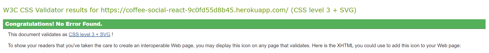 

 
 

 

 

## Responsiveness Testing 

All pages were tested to ensure responsiveness on screen sizes from mobile to desktop for responsive design on Chrome, Edge, Firefox  browsers.

Steps to test:

+ Open browser and navigate to coffee social.
+ Open the developer tools.
+ Set to responsive and decrease width.
+ Click and drag the responsive window to maximum width
+ See if anything breakes

As i was doing my responsive testing nothing broke in any of the browers. so i would consider that a pass.

 
 

### Lighthouse 

 
 

+ I used the chrome developer tool light house witch gave me the insight of how my webpage looked on diffent screens everything looked great on each page and when i ran the light house analizs these are the score i got returned to me.  Testing was performed and found performance to be poor,this was because there where so many images. this could be combatted by improved by compressing images before uploading them. I didnt have time to implimant this but will in the future.

 
 

 

 
 

Lighthouse
 

 
 

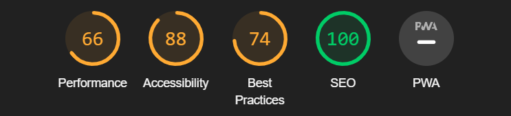 

 
 

 

 

## Deployment 

 
 

The first thing you should do when creating a new project is to deploy it as quick as you can to prevent any nasty errors that might be a pain to fix when your project is complete. For this project I used Heroku to deploy too. I used in React, so the first thing you need to do is to create a React project in you work space and install all the supporting libraries. Once everything is installed you should make sure everthing is working with some hello world text.

 
 

Just to make a note of this the database used in the workspace (db.sqlite3) does not work when deployed to Heroku so we need a differnt database when deplying. I used ElephantSQL database as it was free and works with Heroku. 

 
 

### Deploying To Heroku

+ sign in or create an account if you have to.

+ Click on the New Button on the to right hand corner.

+ enter the name of your new App.

+ select a region.

+ click create.

+ Click on the deploy tab.

+ Conecet to your git hub repository.

+ At the bottom of the deployed tab click on manualy deploy.

+ select the main barnch and click deploy.

+ Good Luck!

### Run Localy

+ Go to the GitHub repo you want to clone

+ Click on the code dropdown menu

+ Select the HTTPS

+ Copy the repo link

+ Open your IDE and in the terminal type git copie-git-url

+ the project you copied is now on your local computer.

 

 
## Conclusion

This project has thought me a lot about the differnt technologys used. It has also thought me a lot about time constrains and working to a deadline. The deadlines forced me to prioritize differnt parts of the project with User Storys and MoSCoW thinking. Moving on if you get stuck on something small and come back to it at a later time is a must when you have time constains. keeping everything well documented is a must, when not fully finishing feature (if you get stuck) so that when you come back to the feature you can pick up where you left off. 

## Credits 

+ Thanks to the tutors at Coding instatute and to my mentor Gareth for guiding me through my project. I would also like to thank Katie Duggan for proofreading the content.
 

+ Fontawesome for icons [Fontawesome](https://fontawesome.com/icons/rss?f=classic&s=solid) 

+ Upload icon [iconscout](https://iconscout.com/free-icon/no-results-4677121) 

### Media 

 
+ This gave me some stock images for the site  [istockphoto](https://www.istockphoto.com/stock-photos) 

+ Favicon was generated by [favicon](https://favicon.io/favicon-generator/) 

 
 

 